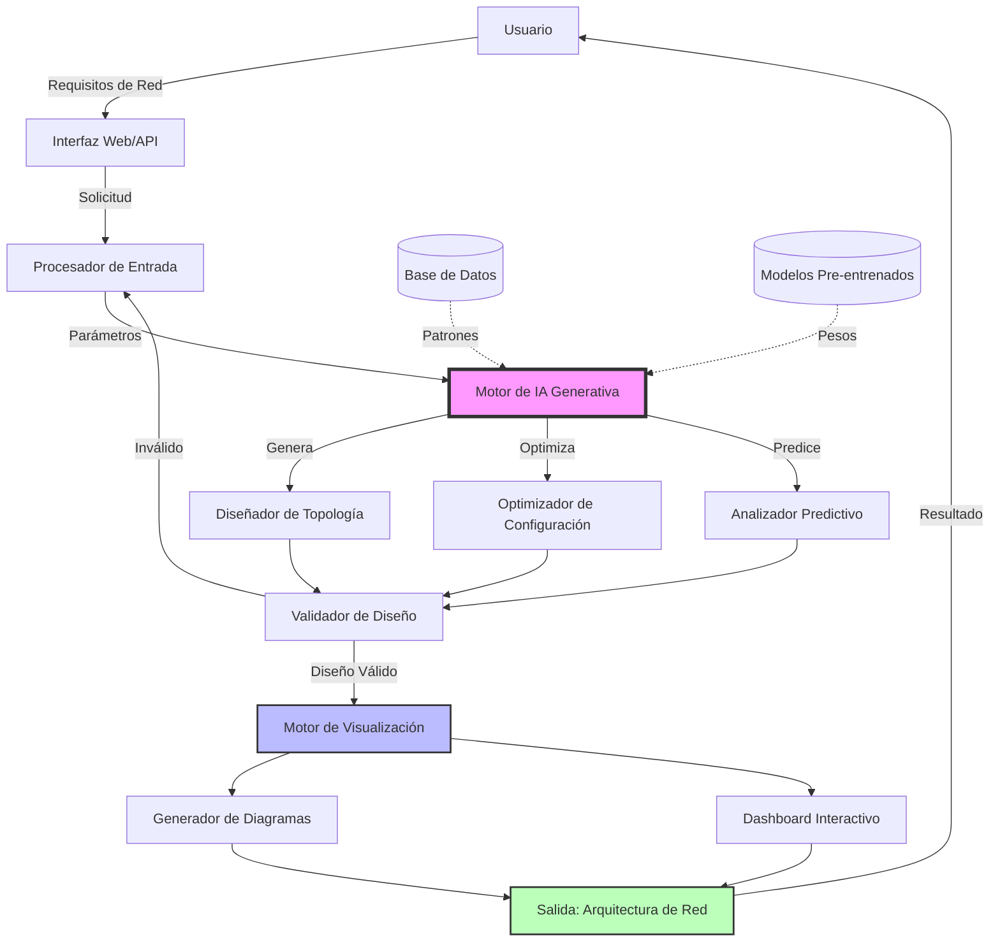
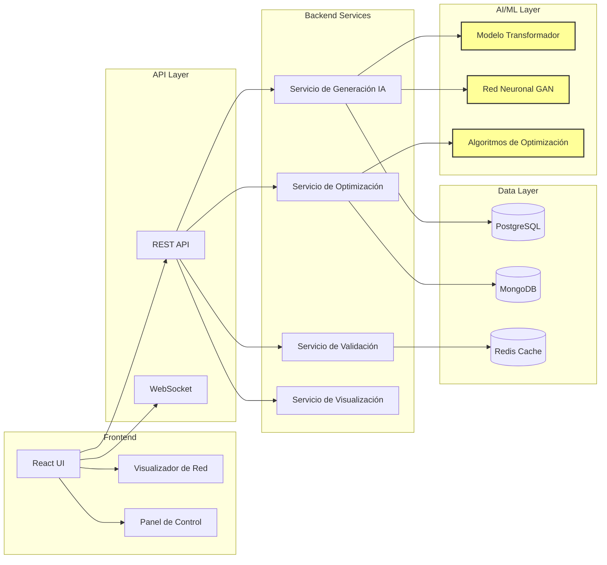
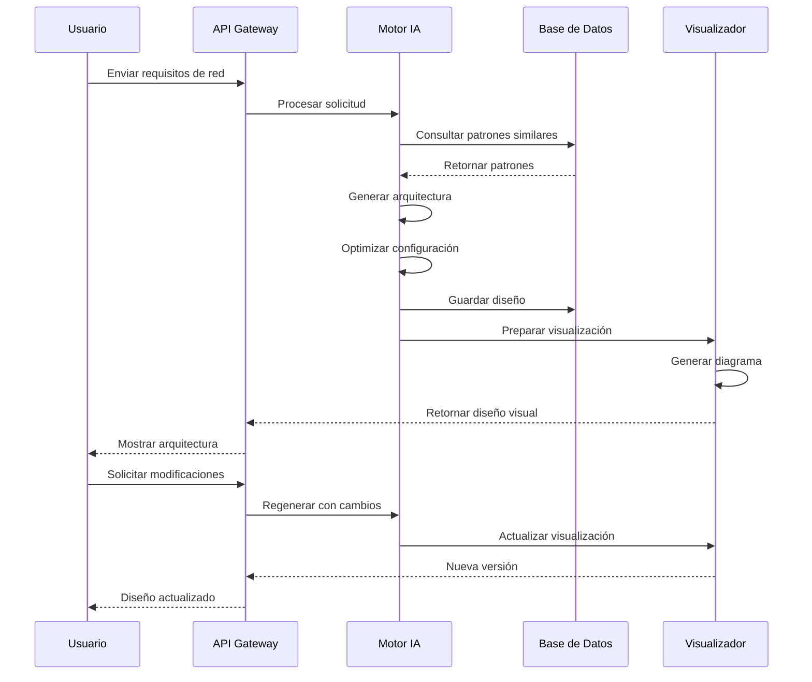
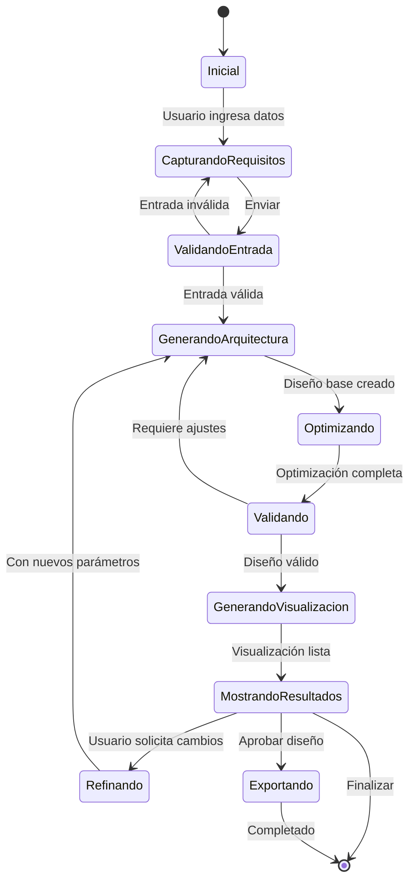

# Generative-AI-Network-Architecture-Design-System

Sistema de Diseño de Arquitectura de Red impulsado por IA Generativa

## 📋 Descripción del Proyecto

Este proyecto implementa un sistema inteligente que utiliza IA Generativa para diseñar, optimizar y visualizar arquitecturas de red. El sistema puede generar automáticamente diseños de topología de red, sugerir configuraciones óptimas y proporcionar análisis predictivos basados en requisitos específicos.

## 📁 Estructura del Proyecto

```
Generative-AI-Network-Architecture-Design-System/
│
├── README.md                                          # Documentación principal
├── Generative_AI_Network_Architecture_Design_System.docx  # Especificaciones del proyecto
│
├── src/                                               # Código fuente (próximamente)
│   ├── ai_models/                                     # Modelos de IA
│   │   ├── generator.py                               # Generador de arquitecturas
│   │   ├── optimizer.py                               # Optimizador de red
│   │   └── predictor.py                               # Análisis predictivo
│   │
│   ├── network_design/                                # Diseño de red
│   │   ├── topology_builder.py                        # Constructor de topología
│   │   ├── config_generator.py                        # Generador de configuración
│   │   └── validator.py                               # Validador de diseños
│   │
│   ├── visualization/                                 # Visualización
│   │   ├── graph_renderer.py                          # Renderizador de grafos
│   │   └── dashboard.py                               # Dashboard interactivo
│   │
│   └── api/                                           # API REST
│       ├── routes.py                                  # Endpoints
│       └── controllers.py                             # Controladores
│
├── tests/                                             # Pruebas unitarias
├── docs/                                              # Documentación adicional
├── data/                                              # Datos de entrenamiento
├── models/                                            # Modelos pre-entrenados
├── config/                                            # Archivos de configuración
└── requirements.txt                                   # Dependencias Python

```

## 🏗️ Arquitectura del Sistema

### Diagrama de Flujo de Datos



### Arquitectura de Componentes



### Flujo de Generación de Arquitectura



### Modelo de Estados



## 🚀 Características Principales

- **Generación Automática**: Crea arquitecturas de red basadas en requisitos de entrada
- **Optimización IA**: Optimiza el diseño para rendimiento, costos y escalabilidad
- **Validación Inteligente**: Verifica la viabilidad y cumplimiento de estándares
- **Visualización Interactiva**: Diagramas interactivos de topología de red
- **Análisis Predictivo**: Predice problemas potenciales y cuellos de botella
- **Exportación Multi-formato**: Exporta a Visio, Draw.io, PDF, y formatos de código

## 🛠️ Tecnologías Utilizadas

- **Backend**: Python, FastAPI, Flask
- **IA/ML**: TensorFlow, PyTorch, Transformers, LangChain
- **Frontend**: React, D3.js, Mermaid.js
- **Base de Datos**: PostgreSQL, MongoDB, Redis
- **Contenedores**: Docker, Kubernetes
- **CI/CD**: GitHub Actions

## 📦 Instalación

```bash
# Clonar el repositorio
git clone https://github.com/rjamoriz/Generative-AI-Network-Architecture-Design-System.git

# Navegar al directorio
cd Generative-AI-Network-Architecture-Design-System

# Crear entorno virtual
python -m venv venv
source venv/bin/activate  # En Windows: venv\Scripts\activate

# Instalar dependencias
pip install -r requirements.txt

# Configurar variables de entorno
cp .env.example .env
# Editar .env con tus configuraciones

# Ejecutar la aplicación
python src/main.py
```

## 🔧 Uso

```python
from src.ai_models.generator import NetworkArchitectureGenerator

# Inicializar generador
generator = NetworkArchitectureGenerator()

# Definir requisitos
requirements = {
    "devices": 100,
    "bandwidth": "10Gbps",
    "redundancy": "high",
    "security_level": "enterprise"
}

# Generar arquitectura
architecture = generator.generate(requirements)

# Visualizar
architecture.visualize()
```

## 🤝 Contribuciones

Las contribuciones son bienvenidas. Por favor:

1. Fork el proyecto
2. Crea tu rama de características (`git checkout -b feature/AmazingFeature`)
3. Commit tus cambios (`git commit -m 'Add some AmazingFeature'`)
4. Push a la rama (`git push origin feature/AmazingFeature`)
5. Abre un Pull Request

## 📄 Licencia

Este proyecto está bajo la Licencia MIT - ver el archivo LICENSE para más detalles.

## 📧 Contacto

Repositorio: [https://github.com/rjamoriz/Generative-AI-Network-Architecture-Design-System](https://github.com/rjamoriz/Generative-AI-Network-Architecture-Design-System)

## 🗺️ Roadmap

- [x] Inicialización del proyecto
- [ ] Implementación del motor de IA
- [ ] Desarrollo de la API REST
- [ ] Interfaz de usuario web
- [ ] Sistema de visualización
- [ ] Integración con herramientas de red existentes
- [ ] Despliegue en producción

---

**Nota**: Este proyecto está en desarrollo activo. Las características y la documentación están sujetas a cambios.
